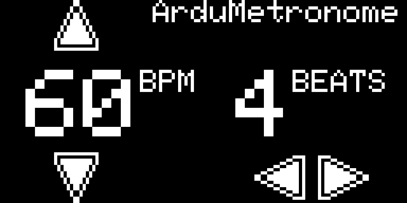

# ArduMetronome
Entry for Arduboy Game Jame 4 - a simple metronome

## Instructions
Use the up/down buttons to increase/decrease beats per minute (BPM) from 35 to 250 by increments of one. 

Use the A/B buttons to increase/decrease beats per minute (BPM) from 35 to 250 by increments of 10.

Use the left/right buttons to increase/decrease time signature from 2/4 to 7/8.

The LED will blink blue at the beginning of each measure. So if the time signature is 4/4, it will blink once every four beats.
